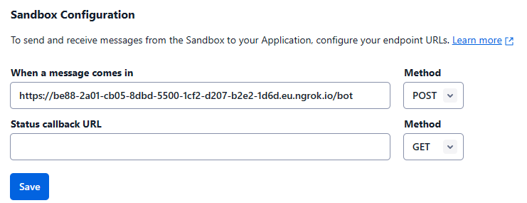

# Twilio-whatsapp-bot
Twilio whatsapp chatbot.
The dialog is configured in text files. The files are thus read in alphabetical order during the discussion.

## Install

### Python 3.10

- https://www.python.org/downloads/release/python-3109/
- put the folder python310 and python/Scripts in the ennvironment variables


### Ngrok

- https://ngrok.com/download
- connect to the ngrok site and copy the AuthToken https://dashboard.ngrok.com/get-started/your-authtoken


### The code:

- download the code
- install dependencies

```
pip install -r requirements.txt
```


### MySQL

- the database script creation is into data folder


## Getting started: 

- Rename "init.env" to ".env"
- Edit ".env" file and put the right values

### launching python code

```
python wsgi.py
```

### Launching ngrok

```
ngrok http 4000
```

- Copy the https:// URL from the ngrok output and then paste it on the "When a message comes in" field.
- Add /bot after the url to expose the endpoint

### Twilio

- Go to [Twilio](https://console.twilio.com/) -> Messaging -> send WhatsApp message -> sandbox parameter
- Put your ngrok address here + /bot

- and save the configuration
